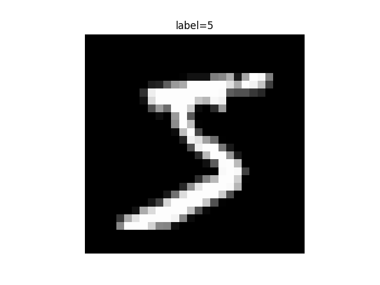

# MNIST数据集与分类任务

这一章的目标是把你即将写的代码背后的任务定义讲清楚。

在开始写 `MNIST` 代码之前，你至少应该知道自己在处理什么数据、要解决什么问题、最终想得到什么结果。

## 1. MNIST 是什么

`MNIST` 是一个经典的手写数字图像数据集。

它的任务很简单：

给模型一张手写数字图片，让模型判断这张图片是 `0` 到 `9` 中的哪一个数字。

所以这是一个标准的多分类任务。

## 2. 一条样本包含什么

你可以把一条 `MNIST` 样本理解成：

1. 一张灰度图像
2. 一个整数标签

其中：

1. 图像是输入
2. 标签是正确答案

模型训练的目标，就是让模型从输入图像中学会预测正确的标签。

## 3. 这类任务的输入和输出是什么

在 `MNIST` 中：

### 输入

一张数字图片。

如果你使用最简单的全连接网络，通常会把图片展平成一维向量后再输入模型。

### 输出

模型会输出 `10` 个类别对应的分数或概率，分别代表：

1. 它有多像 `0`
2. 它有多像 `1`
3. 它有多像 `2`
4. 一直到 `9`

最终分数最高的那个类别，就是模型的预测结果。

## 4. 训练集和测试集分别干什么

这一步非常重要。

### 训练集

训练集用于让模型学习参数。

也就是说，模型会反复看训练集中的样本，不断调整自己的权重。

### 测试集

测试集用于检查模型在“没见过的数据”上的表现。

如果一个模型在训练集表现很好，但在测试集表现差，通常说明它并没有真正学会泛化。

## 5. 当前阶段里，你最需要观察什么

在当前阶段，你最需要观察的不是复杂指标，而是以下几件事：

1. 数据能不能正常加载
2. 样本图像和标签是不是对应正确
3. 输入到模型前的数据 shape 是什么
4. 模型输出是不是 10 个类别
5. 训练后测试准确率有没有明显高于随机猜测

只要这几件事成立，你就已经建立了关于 `MNIST` 任务的第一层真实理解。

## 6. 这一章和代码怎么对应

如果你现在要写 `code/01-mnist最小可运行版/`，这一章实际对应的是以下动作：

1. 下载或读取 `MNIST`
2. 打印训练集和测试集大小
3. 查看几张样本图和对应标签
4. 确认输入张量形状
5. 确认模型输出维度为 `10`

也就是说，这一章不是纯理论，它应该直接帮助你判断自己写出来的第一版代码是不是在做正确的事。

## 7. 第一版代码应该怎么写

如果你现在是第一次动手，我建议分两步，而不是直接上训练脚本。

### 第一步：先只验证数据链路

先写一个更小的脚本：

`code/01-mnist最小可运行版/inspect_data.py`

这个脚本只做四件事：

1. 下载 `MNIST`
2. 打印训练集和测试集大小
3. 打印一条样本的 shape 和标签
4. 保存一张样本图，确认数据真的读到了

参考代码如下：

```python
from pathlib import Path

import matplotlib.pyplot as plt
from torchvision import datasets, transforms


DATA_DIR = Path("data/mnist")

# ToTensor 会把图片转成张量，后面才能继续做计算。
train_dataset = datasets.MNIST(
    root=DATA_DIR,
    train=True,
    download=True,
    transform=transforms.ToTensor(),
)

test_dataset = datasets.MNIST(
    root=DATA_DIR,
    train=False,
    download=True,
    transform=transforms.ToTensor(),
)

# 先确认训练集和测试集都成功拿到了。
print("train size:", len(train_dataset))
print("test size:", len(test_dataset))

# x 是图片张量，y 是这张图片对应的数字标签。
x, y = train_dataset[0]
print("sample shape:", tuple(x.shape))
print("sample label:", y)

# squeeze(0) 会去掉最前面的通道维，方便按灰度图显示。
plt.imshow(x.squeeze(0), cmap="gray")
plt.title(f"label={y}")
plt.axis("off")
plt.savefig("data/mnist/sample.png")
print("saved sample image to data/mnist/sample.png")
```

运行命令：

```bash
source .venv/bin/activate
python "code/01-mnist最小可运行版/inspect_data.py"
```

如果一切正常，你应该能看到：

1. `MNIST` 自动下载到 `data/mnist/`
2. 终端里打印训练集和测试集大小
3. `data/mnist/sample.png` 被成功保存

下面这张图就是当前项目里实际保存出来的第一张 `MNIST` 样本图：



### 第二步：再写最小训练脚本

确认数据没问题之后，再写训练脚本：

`code/01-mnist最小可运行版/train.py`

第一版脚本建议只做这几件事：

1. 从 `data/mnist/` 下载并加载数据
2. 定义一个最简单的两层 `MLP`
3. 训练 `3` 到 `5` 个 `epoch`
4. 输出测试集准确率

下面是一份可以直接作为第一版参考的最小代码骨架：

```python
from pathlib import Path

import torch
from torch import nn
from torch.utils.data import DataLoader
from torchvision import datasets, transforms


DATA_DIR = Path("data/mnist")
BATCH_SIZE = 64
EPOCHS = 3
LR = 1e-3
DEVICE = "cuda" if torch.cuda.is_available() else "cpu"


# transform 负责把原始图片转成张量。
transform = transforms.ToTensor()

train_dataset = datasets.MNIST(
    root=DATA_DIR,
    train=True,
    download=True,
    transform=transform,
)

test_dataset = datasets.MNIST(
    root=DATA_DIR,
    train=False,
    download=True,
    transform=transform,
)

# DataLoader 会按批次取数据，避免一次把全部样本送进模型。
train_loader = DataLoader(train_dataset, batch_size=BATCH_SIZE, shuffle=True)
test_loader = DataLoader(test_dataset, batch_size=BATCH_SIZE)


# Flatten 会把 28x28 图像拉平成一维向量，便于接全连接层。
model = nn.Sequential(
    nn.Flatten(),
    nn.Linear(28 * 28, 128),
    nn.ReLU(),
    nn.Linear(128, 10),
).to(DEVICE)

# 这里先把它理解成“当前分类任务用来计算误差的函数”就够了。
criterion = nn.CrossEntropyLoss()
optimizer = torch.optim.Adam(model.parameters(), lr=LR)


for epoch in range(EPOCHS):
    # train() 表示进入训练模式。
    model.train()
    for x, y in train_loader:
        x, y = x.to(DEVICE), y.to(DEVICE)
        logits = model(x)
        loss = criterion(logits, y)
        # 每一轮反向传播前，都要先清空上一次留下的梯度。
        optimizer.zero_grad()
        loss.backward()
        optimizer.step()

    # 测试前先切到评估状态，这一段只做预测，不更新参数。
    model.eval()
    correct = 0
    total = 0
    with torch.no_grad():
        for x, y in test_loader:
            x, y = x.to(DEVICE), y.to(DEVICE)
            logits = model(x)
            # argmax 会取出分数最高的类别，作为当前预测结果。
            pred = logits.argmax(dim=1)
            correct += (pred == y).sum().item()
            total += y.size(0)

    acc = correct / total
    print(f"epoch={epoch + 1}, test_acc={acc:.4f}")
```

这份代码的意义不是“最终版本就应该这样写”，而是：

1. 它足够短
2. 它足够直观
3. 它能先帮你把闭环跑起来

## 8. 应该怎么运行这份代码

假设你已经在项目根目录准备好了虚拟环境和依赖，那么运行命令就是：

```bash
source .venv/bin/activate
python "code/01-mnist最小可运行版/train.py"
```

如果一切正常，你应该能看到：

1. `MNIST` 自动下载到 `data/mnist/`
2. 每个 `epoch` 输出一次测试集准确率
3. 准确率明显高于随机猜测

## 9. 这份第一版代码你应该重点看什么

第一次跑通后，不要急着优化，先重点观察：

1. `DATA_DIR` 为什么指向 `data/mnist`
2. `Flatten()` 为什么需要出现
3. 为什么最后一层输出是 `10`
4. 这里为什么还需要一个“计算误差”的函数
5. 为什么测试时要先切到评估状态，并且只做预测不更新参数

这些问题在当前阶段可以先记住下面这组直观答案：

1. `DATA_DIR` 指向共享数据目录，这样后面几个阶段可以复用同一份 `MNIST`
2. `Flatten()` 的作用，是把一张 `28 x 28` 的图片拉平成一串数字，方便送进全连接层
3. 最后一层输出是 `10`，因为我们要在 `0` 到 `9` 这 `10` 个类别里做选择
4. “计算误差”的函数用来衡量模型这次预测得有多离谱，模型才能据此继续调整
5. 测试阶段只想看模型现在表现如何，不想在这一步继续学习，所以要切到评估状态，并停止参数更新

## 10. 当前阶段不必深挖的内容

在当前阶段，你还不必深入纠结以下问题：

1. 底层数据文件格式
2. 更复杂的数据增强
3. 更复杂的评价指标
4. 更复杂的网络结构

这些内容后面会出现，但不属于当前阶段的重点。

## 11. 本章小结

当前你可以把 `MNIST` 任务理解成一句最简单的话：

“输入一张数字图片，输出它属于 `0` 到 `9` 中的哪一类。”

而当前阶段的代码任务，就是把这句话第一次真正跑起来。

本章对应的实际运行记录见：

[`book/08-实验记录/01-MNIST最小可运行版实验记录.md`](/Users/liushaojie/WebstormProjects/Project/01_Projects/DeepLearn/book/08-实验记录/01-MNIST最小可运行版实验记录.md)
